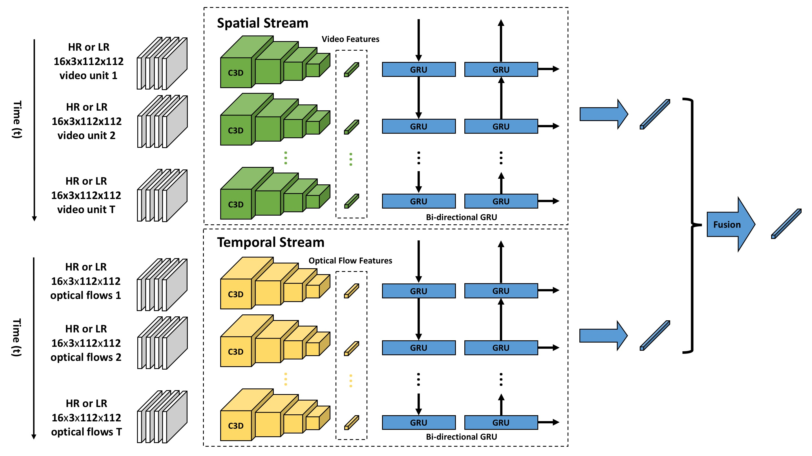

# Extremely Low Resolution (eLR) Action Recognition

## Introduction

This is a PyTorch implementation for our WACV 2018 paper "[`Fully-Coupled Two-Stream Spatiotemporal Networks for Extremely Low Resolution Action Recognition`](https://arxiv.org/pdf/1801.03983.pdf)".



## Environment

- The code is developed with CUDA 9.0, ***Python >= 3.6***, ***PyTorch >= 1.0***

## Data Structure

1. If you want to use our [dataloader](./datasets/hmdb51_data_layer.py), please make sure to put the files as the following structure:
    ```
    $YOUR_PATH_TO_HMDB51_DATASET
    ├── Split1/
    |   ├── Train_hr_features/
    |   |   ├── brush_hair/
    |   |   |   ├── April_09_brush_hair_u_nm_np1_ba_goo_0.npy
    |   |   |   ├── ...
    |   |   ├── cartwheel/
    |   |   |   ├── Acrobacias_de_un_fenomeno_cartwheel_f_cm_np1_ba_bad_8.npy
    |   |   |   ├── ...
    |   |   ├── ...
    |   ├── Train_lr_features/
    |   ├── Train_hr_optfl_features/
    |   ├── Train_lr_optfl_features/
    |   ├── Test_hr_features/
    |   ├── Test_lr_features/
    |   ├── Test_hr_optfl_features/
    |   ├── Test_lr_optfl_features/
    |   ├── Validation_hr_features/
    |   ├── Validation_lr_features/
    |   ├── Validation_hr_optfl_features/
    |   ├── Validation_lr_optfl_features/
    |   ├── ...
    ```

2. Create softlinks of datasets:
    ```
    cd eLR-WACV2018
    ln -s $YOUR_PATH_TO_HMDB51_DATASET data/HMDB51
    ```

## Pretrained Models

- Download the pretrained models on HMDB Split1 at [`here`](https://drive.google.com/drive/u/1/folders/1SCNpOi9jEygH5dUUUhuGZFJBfII2-yMW).

## Training

1. Compute the optical flow for both high and low resolution videos.

    - Please follow the repo here: [Optical Flow Matlab/C++ Code](https://people.csail.mit.edu/celiu/OpticalFlow) [1] or [flownet2-pytorch](https://github.com/NVIDIA/flownet2-pytorch) [2].

2. Train the C3D [2] network (pretrained on Sport-1M dataset) and extract features for video units.
    
    - Please follow the repo here: [C3D-v1.0](https://github.com/facebook/C3D/tree/master/C3D-v1.0) or [c3d-pytorch](https://github.com/DavideA/c3d-pytorch).

3. Train the RNN network with extracted C3D features of each video.
```
cd eLR-WACV2018
# Default Hyperparameters
python tools/pretrained_spatial_temporal_rnn_bidir/train.py
# OR
python tools/pretrained_spatial_temporal_rnn_bidir/train.py --gpu $CUDA_VISIBLE_DEVICES --batch_size $BS --lr $LR
```

## Evaluation
```
cd eLR-WACV2018
# Default Hyperparameters
python tools/pretrained_spatial_temporal_rnn_bidir/eval.py --checkpoint $PATH_TO_CHECKPOINT
# OR
python tools/pretrained_spatial_temporal_rnn_bidir/eval.py --gpu $CUDA_VISIBLE_DEVICES --checkpoint $PATH_TO_CHECKPOINT
```

## Citation

If you are using the data/code/model provided here in a publication, please cite our paper:

    @inproceedings{extremelylow2018wacv,
        title = {Fully-coupled two-stream spatiotemporal networks for extremely low resolution action recognition},
        author = {Mingze Xu and Aidean Sharghi and Xin Chen and David J. Crandall},
        booktitle = {Winter Conference on Applications of Computer Vision (WACV)},
        year = {2018}
    }

## Reference

[1] C. Liu. Beyond pixels: exploring new representations and applications for motion analysis. PhD thesis, Massachusetts Institute of Technology, 2009.

[2] E. Ilg, N. Mayer, T. Saikia, M. Keuper, A. Dosovitskiy, and T. Brox. FlowNet 2.0: Evolution of optical flow estimation with deep networks. In CVPR, 2017.

[3] D. Tran, L. Bourdev, R. Fergus, L. Torresani, and M. Paluri. Learning Spatiotemporal Features with 3D Convolutional Networks. In ICCV, 2015.
